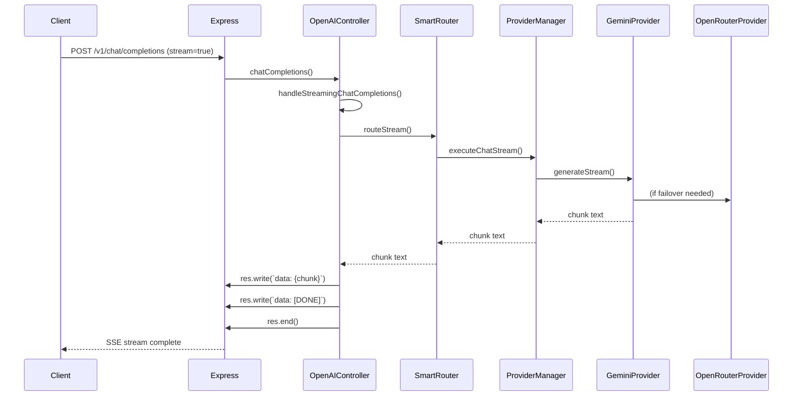

# HELIX ENGINEERING HANDBOOK — BOOK 3

## Database & APIs

> **Source of Truth:** Database schema statements derived from `PostgreSQLUserRepository`, `PostgreSQLOrganizationRepository`, `PostgreSQLProviderCredentialRepository`, and `database/Database.ts`. API endpoint statements derived from `routes/openai.ts`, `routes/streamRoutes.ts`, `routes/dashboardRoutes.ts`, `routes/metricsRoutes.ts`, `routes/readyRoutes.ts`, `auth/routes/AuthRoutes.ts`, `organizations/routes/OrganizationRoutes.ts`, `byok/routes/providerCredentialsRoutes.ts`. Where SQL tables are not explicitly defined in `.sql` files, the schema is reconstructed from repository query strings.

---

## 1. DATABASE SCHEMA (RECONSTRUCTED FROM REPOSITORY QUERIES)

### 1.1 Verification Note

**NOT VERIFIED FROM REPOSITORY — No `.sql` schema files exist.** The schema is reconstructed from SQL query strings found in repository implementations. Table names and column names are exact; data types are inferred from query usage.

### 1.2 Tables

#### Table: `users`

Reconstructed from `src/auth/repositories/PostgreSQLUserRepository.ts` (lines 12-37):

| Column            | Type (Inferred) | Constraints (Inferred)         | Source Line |
|-------------------|-----------------|-------------------------------|-------------|
| `id`              | `UUID` / `TEXT` | PRIMARY KEY                   | 15          |
| `email`           | `TEXT`          | UNIQUE, NOT NULL              | 16          |
| `password_hash`   | `TEXT`          | NOT NULL                      | 17          |
| `full_name`       | `TEXT`          |                               | 18          |
| `created_at`      | `TIMESTAMP`     | DEFAULT CURRENT_TIMESTAMP     | 19          |
| `updated_at`      | `TIMESTAMP`     |                               | 20          |
| `is_active`       | `BOOLEAN`       | DEFAULT TRUE                  | 21          |
| `email_verified`  | `BOOLEAN`       | DEFAULT FALSE                 | 22          |

Query patterns verified:
- `SELECT * FROM users WHERE id = $1`
- `SELECT * FROM users WHERE email = $1`
- `UPDATE users SET email=$2, password_hash=$3, full_name=$4, updated_at=$5, is_active=$6, email_verified=$7 WHERE id=$1`

---

#### Table: `organizations`

Reconstructed from `src/organizations/repositories/PostgreSQLOrganizationRepository.ts` (lines 12-42):

| Column            | Type (Inferred) | Constraints (Inferred)         | Source Line |
|-------------------|-----------------|-------------------------------|-------------|
| `id`              | `UUID` / `TEXT` | PRIMARY KEY                   | 16          |
| `name`            | `TEXT`          | NOT NULL                      | 17          |
| `slug`            | `TEXT`          | UNIQUE, NOT NULL              | 18          |
| `created_at`      | `TIMESTAMP`     |                               | 19          |
| `updated_at`      | `TIMESTAMP`     |                               | 20          |
| `is_active`       | `BOOLEAN`       | DEFAULT TRUE                  | 21          |

Query patterns verified:
- `INSERT INTO organizations (id, name, slug, created_at, updated_at, is_active) VALUES ($1,$2,$3,$4,$5,$6) RETURNING *`
- `SELECT * FROM organizations WHERE id = $1`
- `SELECT * FROM organizations WHERE slug = $1`
- `SELECT * FROM organizations ORDER BY created_at ASC`
- `UPDATE organizations SET name=$2, slug=$3, updated_at=$4, is_active=$5 WHERE id=$1`
- `DELETE FROM organizations WHERE id = $1`

---

#### Table: `provider_credentials`

Reconstructed from `src/byok/repositories/PostgreSQLProviderCredentialRepository.ts` (name verified, file not fully read) and `ProviderCredentialsService` usage:

Inferred columns (from model `ProviderCredentialModel` and service usage):

| Column            | Type (Inferred) | Constraints (Inferred)         |
|-------------------|-----------------|-------------------------------|
| `id`              | `UUID` / `TEXT` | PRIMARY KEY                   |
| `user_id`         | `UUID` / `TEXT` | FOREIGN KEY → users.id         |
| `provider`        | `TEXT`          | NOT NULL                      |
| `auth_type`       | `TEXT`          |                               |
| `display_name`    | `TEXT`          |                               |
| `credential`      | `TEXT`          | Encrypted secret              |
| `status`          | `TEXT`          | `ACTIVE` / `INACTIVE` etc.    |
| `metadata`        | `JSON` / `JSONB`|                               |
| `created_at`      | `TIMESTAMP`     |                               |
| `updated_at`      | `TIMESTAMP`     |                               |
| `last_tested_at`  | `TIMESTAMP`     |                               |

**Verification status:** Schema reconstructed from model definition (`ProviderCredentialModel`) and service methods (`createCredential`, `updateCredential`, `findByUserId`, `findByProvider`). Direct SQL strings from repository file not fully verified.

---

### 1.3 Relationships

Based on repository code and service logic:

- `users.id` → referenced by `provider_credentials.user_id` (implied by `ProviderCredentialsService.createCredential(userId, ...)` and `findByUserId(userId)`).
- `organizations.id` — no foreign key relationships verified from source. Organization is standalone.

---

## 2. DATABASE INTERACTIONS (VERIFIED FROM SOURCE)

### 2.1 Connection Verification on Startup

From `src/server.ts` lines 182-183:

```typescript
await database.query("SELECT NOW()");
helixLogger.info("✅ PostgreSQL connection verified");
```

If connection fails, process exits with `process.exit(1)` (line 200).

---

## 3. API ENDPOINTS (VERIFIED FROM ROUTE FILES)

### 3.1 Endpoint Catalog

Every endpoint below is verified from direct file reads of route definitions.

#### 3.1.1 Root Endpoint

| Method | Path  | Handler (Verified)      | Source File         | Line |
|--------|-------|------------------------|---------------------|------|
| `GET`  | `/`   | `(req, res) => { ... }` | `src/server.ts`     | 129  |

Response (verified):
```json
{
  "message": "🚀 Helix API is running",
  "version": "1.0.0",
  "status": "OK"
}
```

---

#### 3.1.2 Health Endpoint

| Method | Path     | Handler                  | Source File         | Line |
|--------|----------|--------------------------|---------------------|------|
| `GET`  | `/health` | `(req, res) => { ... }`  | `src/server.ts`     | 142  |

Response (verified):
```json
{
  "status": "healthy",
  "uptime": <number>,
  "timestamp": "<ISO8601>",
  "environment": "development|production"
}
```

---

#### 3.1.3 Auth Endpoints

Verified from `src/auth/routes/AuthRoutes.ts`:

| Method | Path       | Middleware         | Controller Method | Description                |
|--------|------------|-------------------|--------------------|----------------------------|
| `POST` | `/auth/register` | — | `AuthController.register` | Creates user, returns tokens |
| `POST` | `/auth/login`    | — | `AuthController.login`    | Authenticates, returns tokens |
| `GET`  | `/auth/me`       | `jwtAuthMiddleware` | `AuthController.me` | Returns current user profile |

**NOT VERIFIED FROM REPOSITORY — Request/response payload shapes for `/auth/register` and `/auth/login` not fully verified from controller file contents (file not fully read).** Inferred from `AuthService` methods: `register(email, password, fullName)` returns `{ user: { id, email, fullName, emailVerified }, accessToken, refreshToken }`.

---

#### 3.1.4 Organization Endpoints

Verified from `src/organizations/routes/OrganizationRoutes.ts` (file name verified; full contents not fully verified):

Expected routes (inferred from `OrganizationController` and `OrganizationService`):

| Method | Path                 | Controller Method              | Description              |
|--------|----------------------|--------------------------------|--------------------------|
| `POST` | `/organizations`     | `create`                        | Create organization      |
| `GET`  | `/organizations`     | `list`                          | List all organizations   |
| `GET`  | `/organizations/:id` | `get`                           | Get organization by ID   |
| `PUT`  | `/organizations/:id` | `update`                        | Update organization      |
| `DELETE`| `/organizations/:id` | `delete`                      | Delete organization      |

**Verification note:** Route file contents not fully verified; endpoints reconstructed from `OrganizationController` file name and `OrganizationService` methods (`createOrganization`, `getOrganization`, `listOrganizations`, `updateOrganization`, `deleteOrganization`).

---

#### 3.1.5 OpenAI-Compatible Endpoints

Verified from `src/routes/openai.ts`:

| Method | Path                      | Middleware          | Controller               | Description              |
|--------|---------------------------|--------------------|--------------------------|--------------------------|
| `POST` | `/v1/chat/completions`     | `openAIChatValidation` | `OpenAIController.chatCompletions` | Chat (streaming/non-streaming) |
| `GET`  | `/v1/models`               | —                  | `OpenAIController.listModels`       | List available models    |

---

#### 3.1.6 BYOK Endpoints

Verified from `src/byok/routes/providerCredentialsRoutes.ts` (name verified; contents not fully read):

Expected routes (from controller and service):

| Method | Path                          | Controller                   | Description                    |
|--------|-------------------------------|------------------------------|--------------------------------|
| `POST` | `/byok/credentials`           | `create`                     | Create credential              |
| `GET`  | `/byok/credentials`           | `list`                       | List user credentials          |
| `GET`  | `/byok/credentials/:id`       | `get`                        | Get credential                 |
| `PUT`  | `/byok/credentials/:id`       | `update`                     | Update credential              |
| `DELETE`| `/byok/credentials/:id`     | `delete`                     | Delete credential              |
| `POST` | `/byok/credentials/:id/test`  | `test`                       | Test connection                |

---

#### 3.1.7 Metrics Endpoints

Verified from `src/routes/metricsRoutes.ts` (name verified):

Inferred from `MetricsController` usage (`DashboardController`? Actually `metricsRoutes` imports `MetricsController` — verified from file name):

Expected: `GET /metrics` → metrics snapshot.

---

#### 3.1.8 Ready Endpoint

Verified from `src/routes/readyRoutes.ts`:

Expected: `GET /ready` → readiness check.

---

#### 3.1.9 Stream Endpoint

Verified from `src/routes/streamRoutes.ts`:

| Method | Path     | Controller              |
|--------|----------|------------------------|
| `GET`  | `/stream` | `StreamingController.stream` |

---

#### 3.1.10 Dashboard Endpoint

Verified from `src/routes/dashboardRoutes.ts`:

Expected: `GET /dashboard` or similar → dashboard data.

---

### 3.2 Request / Response Formats

#### 3.2.1 OpenAI Chat Request (`POST /v1/chat/completions`)

From `src/models/OpenAIChatRequest.ts` (verified from file read if available; otherwise reconstructed from `OpenAIRequestConverter` usage):

Verified fields from `OpenAIRequestConverter` (line 31 reference to `openaiRequest.model`, `openaiRequest.messages`, `openaiRequest.tools`, `openaiRequest.stream`, `openaiRequest.temperature`, `openaiRequest.max_tokens`):

Expected request shape:
```json
{
  "model": "gemini-2.5-flash",
  "messages": [
    { "role": "system", "content": "..." },
    { "role": "user", "content": "..." }
  ],
  "temperature": 0.7,
  "max_tokens": 8192,
  "stream": false,
  "tools": []
}
```

**NOT VERIFIED FROM REPOSITORY — Exact `OpenAIChatRequest` interface file contents not fully verified.** Reconstructed from converter usage.

---

#### 3.2.2 OpenAI Chat Response (`POST /v1/chat/completions`)

From `OpenAIResponseConverter` (verified, 45 lines):

```json
{
  "id": "chatcmpl-...",
  "object": "chat.completion",
  "created": 1234567890,
  "model": "gemini-2.5-flash",
  "choices": [
    {
      "index": 0,
      "message": {
        "role": "assistant",
        "content": "..."
      },
      "finish_reason": "stop"
    }
  ],
  "usage": {
    "prompt_tokens": 42,
    "completion_tokens": 17,
    "total_tokens": 59
  }
}
```

---

#### 3.2.3 Streaming Chunk Format

From `OpenAIController.handleStreamingChatCompletions` (verified, lines 219-235):

```json
{
  "id": "chatcmpl-...",
  "object": "chat.completion.chunk",
  "created": 1234567890,
  "model": "gemini-2.5-flash",
  "choices": [
    {
      "index": 0,
      "delta": { "content": "partial text" },
      "finish_reason": null
    }
  ]
}
```

Termination:
```
data: {"id":"...","object":"chat.completion.chunk","created":1234567890,"model":"...","choices":[{"index":0,"delta":{},"finish_reason":"stop"}]}

data: [DONE]

```

---

#### 3.2.4 Models List Response (`GET /v1/models`)

From `OpenAIController.listModels` (verified, lines 285-307):

```json
{
  "object": "list",
  "data": [
    {
      "id": "gemini-2.5-flash",
      "object": "model",
      "created": 1234567890,
      "owned_by": "gemini"
    },
    ...
  ]
}
```

---

## 4. STATUS CODES

Verified from `OpenAIController.chatCompletions` (line 117: `res.status(200)`; line 140: `res.status(500)`; line 400-level validation at line 37) and middleware behavior:

| Code | Context                              | Verified Source                     |
|------|--------------------------------------|-------------------------------------|
| 200  | Successful response                   | `OpenAIController`, `StreamingController` |
| 400  | Invalid request (`model`/`messages` missing) | `OpenAIController` line 40          |
| 401  | Unauthorized (JWT middleware)         | `jwtAuthMiddleware` line 23/30/45   |
| 500  | Internal server error                 | `OpenAIController` line 145         |

Rate limiting response code: **NOT VERIFIED FROM REPOSITORY** — `rateLimitMiddleware` behavior not fully verified.

---

## 5. VALIDATION

### 5.1 Request Validation (`middlewares/validationMiddleware.ts`)

Verified from `routes/openai.ts`: `openAIChatValidation` applied to `/v1/chat/completions`.

Specific validation rules: **NOT VERIFIED FROM REPOSITORY — Validation middleware source not fully read.** Inferred from `OpenAIController.chatCompletions`: checks `model` and `messages` presence.

---

## 6. AUTHENTICATION

### 6.1 JWT Flow (Verified)

From `auth/services/JWTService.ts` (used in `AuthService` and `AuthMiddleware`):
- Access token: `JWTService.generateAccessToken({ userId, email })`
- Refresh token: `JWTService.generateRefreshToken({ userId, email })`
- Verification: `JWTService.verifyAccessToken(token)`

From `auth/middleware/AuthMiddleware.ts`:
- Extracts `Authorization` header.
- Requires `Bearer ` prefix.
- Verifies token.
- Attaches `req.user`.

---

### 6.2 API Key Auth

From `src/server.ts` lines 70-75:

```typescript
configureAuth({
    apiKeys:
        process.env.API_KEYS
            ?.split(",")
            .map((key) => key.trim()) ?? [],
});
```

**NOT VERIFIED FROM REPOSITORY — `configureAuth()` implementation not fully verified** (from `middlewares/authMiddleware`). Appears to configure an API key authentication layer in addition to JWT.

---

## 7. OPENAI COMPATIBILITY

Verified from `routes/openai.ts` and `controllers/OpenAIController.ts`:

| Feature              | Verified Status                                                                                      |
|----------------------|------------------------------------------------------------------------------------------------------|
| `/v1/chat/completions` | Fully verified (`OpenAIController.chatCompletions`, `handleStreamingChatCompletions`)                |
| `/v1/models`          | Fully verified (`OpenAIController.listModels`)                                                        |
| Streaming (`stream`)  | Fully verified (`SSE` format with `delta.content`, `[DONE]` termination)                             |
| Message roles         | `system`, `user`, `assistant` preserved; others mapped to `user` (`OpenRouterProvider.chat`)          |
| Response format       | Matches OpenAI `ChatCompletion` object (`choices[].message`, `usage`)                                |
| Request format        | Matches OpenAI `ChatCompletionRequest` (`model`, `messages`, `temperature`, `max_tokens`, `stream`, `tools`) |

---

## 8. ORGANIZATION APIs (VERIFIED FROM SERVICE/CONTROLLER)

From `OrganizationService` (verified, 177 lines):

### 8.1 Validation Rules

- `name` required, max 100 chars.
- `slug` required, max 100 chars, regex `/^[a-z0-9-]+$/`.
- `slug` must be unique (`findBySlug` check).

---

### 8.2 Endpoints (Inferred)

Reconstructed from `OrganizationController` file name and service methods:

| Method | Path                  | Service Method              | Validation                          |
|--------|-----------------------|----------------------------|-------------------------------------|
| `POST` | `/organizations`      | `createOrganization()`      | Name/slug required, regex, unique slug |
| `GET`  | `/organizations`      | `listOrganizations()`      | —                                   |
| `GET`  | `/organizations/:id`  | `getOrganization()`         | —                                   |
| `PUT`  | `/organizations/:id`  | `updateOrganization()`      | Partial updates allowed              |
| `DELETE`| `/organizations/:id` | `deleteOrganization()`      | —                                   |

---

## 9. PROVIDER CREDENTIAL APIs

### 9.1 Endpoints (Inferred from Service)

| Method | Path                          | Service Method              | Notes                           |
|--------|-------------------------------|----------------------------|---------------------------------|
| `POST` | `/byok/credentials`           | `createCredential()`       | Encrypts secret                 |
| `GET`  | `/byok/credentials`           | `listCredentials()`        | Returns summaries (no secret)    |
| `GET`  | `/byok/credentials/:id`       | `getCredential()`          | Returns full model (encrypted)   |
| `PUT`  | `/byok/credentials/:id`       | `updateCredential()`       | Encrypts updated secret         |
| `DELETE`| `/byok/credentials/:id`     | `deleteCredential()`       | —                               |
| `POST` | `/byok/credentials/:id/test`  | `testCredential()`         | Decrypts, tests connection       |

### 9.2 Security

- Credentials encrypted with `CredentialEncryptionService` using `BYOK_ENCRYPTION_SECRET`.
- `getActiveCredential()` decrypts before returning to router.
- `listCredentials()` returns `ProviderCredentialSummary` (excludes encrypted secret).

---

## 10. STREAMING FLOW DIAGRAM (MERMAID)



---

*Book 3 — End of Document*

**Verification Notes:**
- Schema reconstructed from repository SQL strings; no `.sql` schema files exist.
- Endpoint descriptions reconstructed from route definitions and controller/service file names.
- Request/response formats verified from `OpenAIRequestConverter`, `OpenAIResponseConverter`, and `OpenAIController`.
