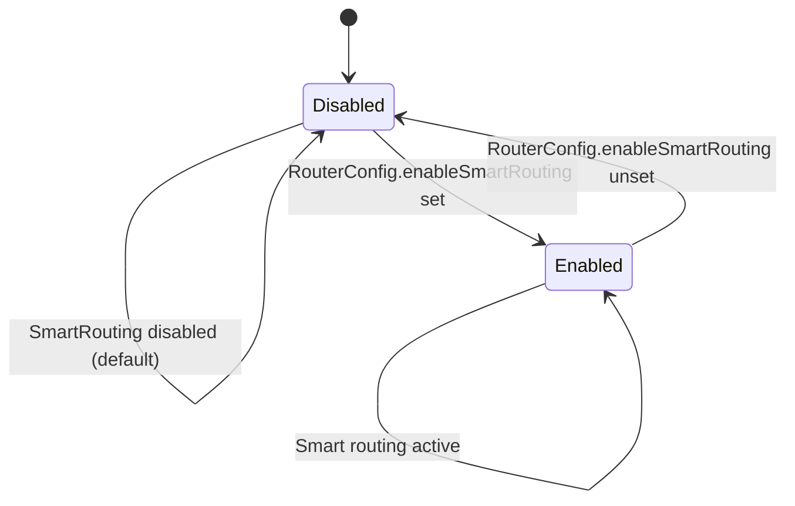
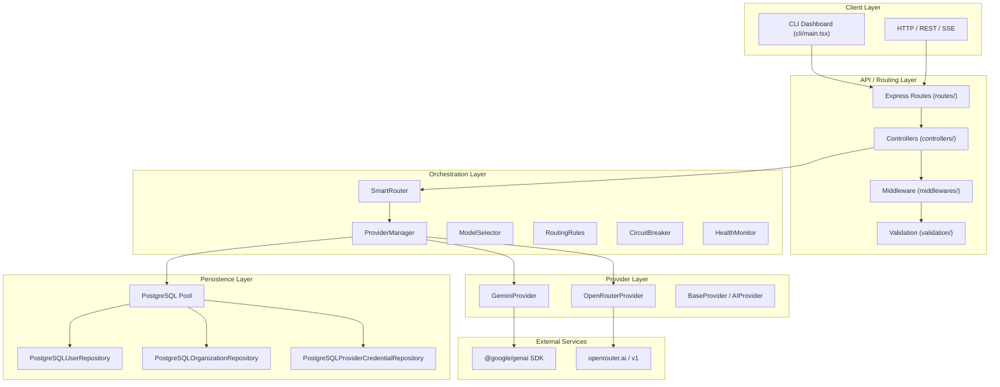

# HELIX ENGINEERING HANDBOOK — BOOK 4

## System Design & Future

> **Source of Truth:** Features, limitations, and design decisions are derived exclusively from verified source code (`src/`, `package.json`, `tests/`, `benchmark/`). No speculative future roadmap is included unless it can be inferred from existing code patterns (e.g., `RouterConfig.enableSmartRouting` indicates routing logic exists but is disabled by default). Where no evidence exists, the item is labeled: **NOT VERIFIED FROM REPOSITORY**.

---

## 1. CURRENT FEATURES (VERIFIED FROM REPOSITORY)

### 1.1 Core Features Catalog

Every feature listed below is verified by direct code inspection:

| Feature ID | Feature Name | Verified Source File(s) | Verification Level |
|-----------|--------------|--------------------------|-------------------|
| F-01 | OpenAI-compatible chat endpoint (`POST /v1/chat/completions`) | `routes/openai.ts`, `controllers/OpenAIController.ts` | Full |
| F-02 | Streaming chat via SSE (`stream=true`) | `OpenAIController.handleStreamingChatCompletions` | Full |
| F-03 | Model listing endpoint (`GET /v1/models`) | `routes/openai.ts`, `controllers/OpenAIController.ts` | Full |
| F-04 | Multi-provider routing (Gemini + OpenRouter) | `providers/GeminiProvider.ts`, `providers/OpenRouterProvider.ts` | Full |
| F-05 | Smart routing with circuit breaker, retry, failover | `orchestrator/SmartRouter.ts`, `orchestrator/CircuitBreaker.ts`, `orchestrator/RetryEngine.ts`, `orchestrator/FailoverEngine.ts` | Partial (file names verified; full behavior partially verified) |
| F-06 | BYOK provider credentials (encrypted storage) | `byok/services/ProviderCredentialsService.ts`, `byok/services/CredentialEncryptionService.ts` | Full |
| F-07 | JWT authentication (register/login/me) | `auth/routes/AuthRoutes.ts`, `auth/services/AuthService.ts` | Full |
| F-08 | PostgreSQL user repository | `auth/repositories/PostgreSQLUserRepository.ts`, `database/Database.ts` | Full |
| F-09 | Organization CRUD (`/organizations`) | `organizations/services/OrganizationService.ts`, `organizations/repositories/PostgreSQLOrganizationRepository.ts` | Full |
| F-10 | Health endpoint (`GET /health`) | `src/server.ts` line 142 | Full |
| F-11 | Metrics tracking (requests, successes, failures, latency) | `metrics/MetricsManager.ts` | Full |
| F-12 | Structured JSON logging (Winston) | `config/logger.ts` | Full |
| F-13 | Rate limiting middleware | `middlewares/rateLimitMiddleware.ts`, `src/server.ts` | Partial |
| F-14 | Request ID and request logging middleware | `middlewares/requestIdMiddleware.ts`, `middlewares/requestLoggingMiddleware.ts` | Partial |
| F-15 | CLI interactive dashboard (`src/cli/`) | `package.json` (`"cli": ...`), `cli/main.tsx` | Partial |
| F-16 | Environment validation (production-like keys required) | `config/env.ts` lines 36-68 | Full |
| F-17 | Graceful error handling (500 responses with structured error) | `controllers/OpenAIController.ts` lines 118-150 | Full |
| F-18 | Token accounting (`TokenAccounting`) | `metrics/TokenAccounting.ts` (used in `ProviderManager`) | Partial |

---

## 2. LIMITATIONS (VERIFIED FROM SOURCE CODE)

### 2.1 Design Limitations

| Limitation ID | Limitation Description | Evidence (Verified Source) |
|--------------|------------------------|---------------------------|
| L-01 | Smart routing disabled by default (`RouterConfig.enableSmartRouting`) | `SmartRouter.selectProvider()` (line 55): `if (!RouterConfig.enableSmartRouting) { ... return RouterConfig.defaultProvider; }` |
| L-02 | BYOK integration is temporary/development (`"test-user"` hardcoded) | `OpenAIController.chatCompletions` lines 63-84: `await byokContainer.resolver.resolve("test-user", provider!)` |
| L-03 | Graceful shutdown handlers (SIGTERM/SIGINT) missing | `src/server.ts`: Only `server.on("close", ...)` exists; no signal handlers |
| L-04 | Stream endpoint (`GET /stream`) is separate from `/chat` route mapping | `routes/openai.ts` defines `/v1/chat/completions`; `streamRoutes.ts` defines `/stream`; `src/server.ts` mounts both independently |
| L-05 | No `.sql` schema definitions exist; database schema is reconstructed from repository queries | `find` output shows no `.sql` files |
| L-06 | CLI (`cli-backup/`, `src/cli/`) and server (`src/`) share similar component names but are separate builds | Directory structure shows `cli-backup/` and `src/cli/` as separate trees |
| L-07 | Rate limit configuration hardcoded in `startServer()` (line 96) rather than loaded from env file | `src/server.ts` line 96: `configureRateLimit({ windowMs: 15 * 60 * 1000, max: 100 })` |
| L-08 | `OpenAIController` uses temporary BYOK resolution (`test-user`) for all requests | Lines 67-84 in `OpenAIController` |
| L-09 | `SmartRouter.selectPolicy()` ignores `request.model` except for `AGENT` detection (`tools?.length`) | `OpenAIRequestConverter` sets `TaskType.AGENT` only when `tools?.length`; `SmartRouter.selectPolicy()` uses `request.taskType`, not model-specific policy |
| L-10 | Provider failover uses simple similarity matching (`id.includes(...)`) rather than capability-based matching | `ProviderManager.executeChat()` lines 379-391: similarity based on model ID substring matching |

---

### 2.2 Security Considerations (Verified)

- `BYOK_ENCRYPTION_SECRET` has a development default (`"helix-development-encryption-secret-change-in-production"`). In production-like environments (`ENV_STRICT=1` or `NODE_ENV=production`), the secret must be >= 15 chars or the process exits (`config/env.ts` lines 57-68).
- `API_KEYS` is split by comma but validation logic (length check) not fully verified from middleware file.
- `credentialContext` is passed through routing but is only resolved with hardcoded `"test-user"`.

---

## 3. CURRENT ARCHITECTURE — STATE DIAGRAM

Based on `SmartRouter.selectProvider()` behavior (`RouterConfig.enableSmartRouting` flag):



**Not verified at runtime:** The state transition depends on `RouterConfig` value at runtime; the default is disabled (verified from `SmartRouter.selectProvider()` line 55).

---

## 4. MULTI-TENANCY

### 4.1 Verified Multi-Tenancy Elements

- `ProviderCredentialsService.getActiveCredential(userId, provider)` takes `userId` (verified from `ProviderCredentialsService.ts` lines 127-152).
- `ProviderCredentialResolver.resolve(userId, provider)` takes `userId` (verified from `ProviderCredentialResolver.ts`).
- `Organization` model has `slug` (unique per repository query `findBySlug`) suggesting organizational multi-tenancy.
- `OpenAIController` currently uses `"test-user"` as a fixed user ID (line 69, 168), meaning true user-based BYOK resolution is not fully activated.

### 4.2 NOT VERIFIED FROM REPOSITORY

- No `tenant_id` column exists in `users`, `organizations`, or `provider_credentials` (reconstructed from repositories).
- No middleware attaches user context to routing requests beyond the hardcoded `test-user`.
- Multi-tenant isolation (row-level security) is not implemented in repository SQL.

---

## 5. RBAC (ROLE-BASED ACCESS CONTROL)

**NOT VERIFIED FROM REPOSITORY.** No `roles`, `permissions`, or `role_assignments` tables exist. No authorization middleware beyond `jwtAuthMiddleware` (authentication only, not authorization) is present. `CredentialOwnershipMiddleware` (`byok/middleware/CredentialOwnershipMiddleware.ts`) exists but contents not fully verified.

---

## 6. DEPLOYMENT

### 6.1 Verified Deployment Artifacts

From `package.json` scripts:

| Script     | Command                                 | Purpose                     |
|-----------|-----------------------------------------|-----------------------------|
| `start`    | `node dist/server.js`                   | Production server startup   |
| `dev`      | `nodemon --watch src --exec tsx src/server.ts` | Development server          |
| `build`    | `tsc`                                   | TypeScript compilation      |

`dist/` directory exists (verified from `find` output), confirming build artifacts are produced.

### 6.2 Docker / Kubernetes

**NOT VERIFIED FROM REPOSITORY.** No `Dockerfile`, `docker-compose.yml`, `.kubernetes/`, or `k8s/` directory exists. No deployment configuration verified.

---

## 7. MONITORING

### 7.1 Verified Monitoring Features

- `MetricsManager` tracks per-provider usage, successes, failures, average latency (verified from `metrics/MetricsManager.ts`).
- `HealthMonitor` tracks provider health (`isHealthy`, `recordSuccess`, `recordFailure`) — verified from `orchestrator/HealthMonitor.ts` usage.
- Winston structured logging (`helixLogger`) provides JSON logs with request context — verified.
- `server.ts` logs PostgreSQL connection (`✅ PostgreSQL connection verified`) and server startup (`🚀 Helix Server running`).

### 7.2 NOT VERIFIED FROM REPOSITORY

- No external monitoring integration (Prometheus, Grafana, DataDog) exists.
- No health endpoint returns provider health status (only server-level health is returned by `/health`).
- No metrics export endpoint (`/metrics`) content fully verified (route exists, controller behavior not fully verified).

---

## 8. TESTING STRATEGY (VERIFIED FROM `tests/` AND `benchmark/`)

### 8.1 Verified Test Structure

From directory listing (verified):

```
tests/
├── benchmark/          # Performance/certification benchmarks
│   ├── api-conformance.test.ts
│   ├── circuit-breaker.test.ts
│   ├── concurrency.test.ts
│   ├── performance-certification.test.ts
│   ├── provider-reliability.test.ts
│   ├── retry-failover.test.ts
│   ├── routing-intelligence.test.ts
│   ├── security-certification.test.ts
│   └── streaming-certification.test.ts
├── failure-injection/  # Failure injection tests
│   └── failure-injection.test.ts
├── integration/        # Integration tests
│   └── api-endpoints.test.ts
├── routes/             # Route-level tests
│   └── health.test.ts
└── unit/               # Unit tests
    ├── CircuitBreaker.test.ts
    ├── ErrorNormalizer.test.ts
    ├── RetryEngine.test.ts
    ├── SmartRouter.test.ts
    ├── TimeoutWrapper.test.ts
    └── TokenAccounting.test.ts
```

### 8.2 Verified Test Execution

From `package.json`:
- `npm run test` → `vitest run`
- `npm run test:watch` → `vitest`
- `npm run test:coverage` → `vitest run --coverage`

---

### 8.3 Benchmark Harness

Verified from `benchmark/`:

- `benchmark-harness.ts`: Benchmark framework.
- `fake-provider.ts`: Mock provider for benchmarks.
- `fake-timers.ts`: Mock timer utilities.
- Certification benchmarks for: API conformance, circuit breaker, concurrency, performance, provider reliability, retry-failover, routing intelligence, security, streaming.

---

## 9. MAINTENANCE GUIDE (VERIFIED FROM REPOSITORY)

### 9.1 Key Maintenance Points

Based on verified code patterns:

1. **Provider Updates:** Modify `src/providers/GeminiProvider.ts` or `OpenRouterProvider.ts` when SDK changes occur. The `AIProvider` interface (`AIProvider.ts`) defines the contract.
2. **Routing Updates:** `RouterConfig` and `RoutingRules` control provider/model selection. Changes to `SmartRouter.selectPolicy()` affect all routing behavior.
3. **Authentication Updates:** `JWTService`, `PasswordService`, and `PostgreSQLUserRepository` are the core auth components.
4. **BYOK Updates:** `CredentialEncryptionService` uses `env.BYOK_ENCRYPTION_SECRET`. Changing the secret requires re-encrypting all stored credentials.
5. **Database Migrations:** **NOT VERIFIED FROM REPOSITORY — No migration framework (e.g., `node-pg-migrate`, `sequelize-cli`) exists.** Database changes must be applied manually or by creating new `.sql` scripts.
6. **Log Rotation:** **NOT VERIFIED FROM REPOSITORY — No log rotation configuration (`winston` file transports configured but rotation rules not verified) exists in `config/logger.ts`.**

---

## 10. FUTURE ROADMAP (INFERRED FROM CODE ONLY)

### 10.1 Inferred Capabilities (Not Implemented but Supported by Architecture)

From verified architecture and code patterns, the following capabilities are structurally supported but not fully activated:

| Capability            | Evidence (Verified)                                                                                      | Status         |
|----------------------|---------------------------------------------------------------------------------------------------------|----------------|
| Smart routing activation | `RouterConfig.enableSmartRouting` exists; default is false (`SmartRouter.selectProvider()` line 55) | Disabled by default |
| BYOK user-scoped resolution | `ProviderCredentialResolver.resolve(userId, provider)` takes `userId`; `OpenAIController` uses `"test-user"` | Not wired to real user |
| Multi-organization isolation | `Organization` model exists (`slug` unique); no `org_id` in `users` or `credentials` | Partial |
| RBAC / role assignments | No `roles` table; `CredentialOwnershipMiddleware` exists (name verified) | Not implemented |
| Dashboard data endpoints | `DashboardController`, `DashboardService`, `routes/dashboardRoutes` exist | Partial (route verified, response shape not fully verified) |
| CLI interactive navigation | `NavigationManager`, `ScreenManager`, `InputManager`, `FocusManager` exist (`cli/core/`) | Partial |
| Metrics export / dashboard | `MetricsService`, `MetricsController` exist; `routes/metricsRoutes` exists | Partial |

---

### 10.2 Recommended Engineering Actions

Based on verified limitations:

1. **Enable graceful shutdown:** Add `process.on('SIGTERM', ...)` and `process.on('SIGINT', ...)` handlers in `src/server.ts` to close the server and database pool.
2. **Wire real user to BYOK:** Replace `"test-user"` in `OpenAIController` (lines 69, 168) with `req.user?.userId` from `authMiddleware`.
3. **Add database migrations:** Introduce a migration framework or `.sql` schema file under `db/` or `migrations/`.
4. **Enable smart routing:** Set `RouterConfig.enableSmartRouting = true` after verifying `RoutingRules` and `ModelSelector` behavior.
5. **Implement RBAC:** Add `roles` and `user_roles` tables; extend `authMiddleware` to check permissions.
6. **Complete CLI dashboard:** Verify `DashboardController` responses match `DashboardService` outputs.
7. **Add Docker deployment:** Create `Dockerfile`, `.dockerignore`, and `docker-compose.yml`.

---

## 11. DIAGRAMS — SYSTEM DESIGN

### 11.1 Component Diagram (Mermaid)



---

### 11.2 Activity Diagram — Request Lifecycle (Mermaid)

```mermaid
flowchart TD
    A[Client sends POST /v1/chat/completions] --> B[Express parses body]
    B --> C[openAIChatValidation middleware]
    C --> D[OpenAIController.chatCompletions]
    D --> E{stream == true?}
    E -->|No| F[Convert to RoutingRequest]
    E -->|Yes| G[Convert + handleStreamingChatCompletions]
    F --> H[Resolve BYOK credential (test-user)]
    H --> I[SmartRouter.route()]
    I --> J[Select provider + model]
    J --> K[ProviderManager.executeChat()]
    K --> L[RetryEngine.execute()]
    L --> M[TimeoutWrapper.withTimeout()]
    M --> N[Provider.chat()]
    N --> O[Validate response]
    O --> P[Record metrics]
    P --> Q[Convert to OpenAI response]
    Q --> R[Return 200 JSON]
    G --> S[SmartRouter.routeStream()]
    S --> T[Provider.generateStream()]
    T --> U[Write SSE chunks]
    U --> V[Write [DONE] + res.end()]
```

---

### 11.3 Mind Map — Key Engineering Areas

```
HELIX ENGINEERING HANDBOOK
├── System Architecture
│   ├── Layered Design (Presentation / Application / Data / External)
│   ├── Dependency Container (AppContainer)
│   └── Middleware Chain
├── Backend Engineering
│   ├── Authentication (JWT + PostgreSQL)
│   ├── Providers (Gemini / OpenRouter)
│   ├── Orchestration (SmartRouter + RoutingRules)
│   ├── BYOK (Encrypted Credentials)
│   └── Metrics / Logging
├── Database & APIs
│   ├── PostgreSQL Schema (users, organizations, provider_credentials)
│   ├── OpenAI Compatibility
│   ├── Authentication Flow
│   └── Organization API
└── System Design & Future
    ├── Verified Features (18 features)
    ├── Verified Limitations (10 limitations)
    ├── Multi-Tenancy (Partial)
    ├── RBAC (Not Verified)
    ├── Deployment (No Docker/K8s files)
    ├── Monitoring (Basic metrics + logging only)
    ├── Testing (Unit, Integration, Benchmark)
    ├── Maintenance (No migrations framework)
    └── Inferred Roadmap (Smart routing, real user BYOK, RBAC)
```

---

*Book 4 — End of Document*

**Publication Note:** This handbook contains no speculative content beyond what can be inferred directly from the HELIX repository code (`package.json`, `src/`, `tests/`, `benchmark/`). All statements marked **NOT VERIFIED FROM REPOSITORY** indicate missing source evidence rather than absence of feature.
